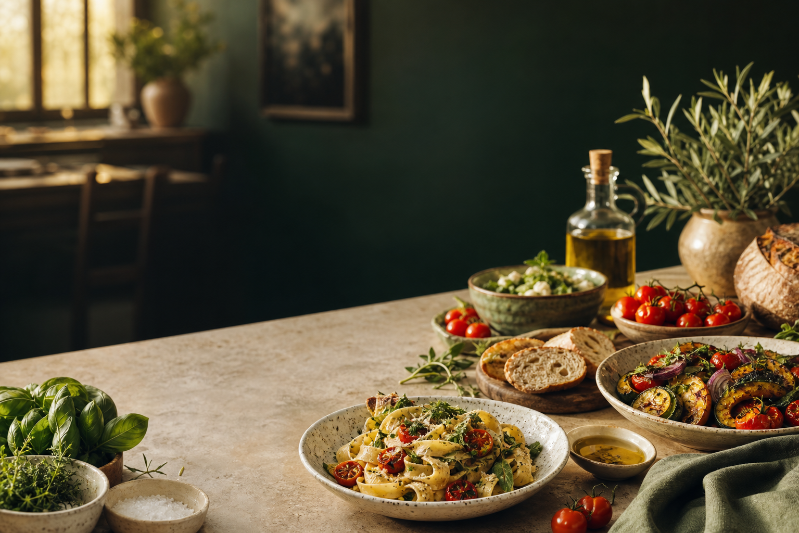

# Savora — World Food Discovery



Savora is a polished world-food discovery experience for exploring signature dishes from around the globe. It combines cultural discovery with practical cooking guidance through curated recipes, detailed ingredients, step-by-step methods, country-based search, persistent favorites, and optional live Spoonacular results.

The built-in catalog works immediately without an account, API key, or network request.

## Features

- 20 complete international recipes from Europe, Asia, Africa, the Middle East, and the Americas
- Search by country, cuisine, dish, ingredient, category, or dietary preference
- Responsive recipe cards and accessible recipe-detail modals
- Ingredients, preparation times, servings, estimated prices, and numbered instructions
- **Surprise Me** discovery using the current results or complete catalog
- Persistent **My Favorites** collection backed by `localStorage`
- Contact section and responsive multi-column footer
- Safe local fallback when Spoonacular is unavailable
- Mobile, tablet, and desktop layouts
- Modern React JavaScript, Tailwind CSS, and ESLint validation

## Featured Countries

| Region | Countries |
| --- | --- |
| Middle East and North Africa | Lebanon, Morocco, Tunisia, Türkiye |
| Europe | Austria, France, Greece, Italy, Norway, Spain |
| Asia | India, Japan, South Korea, Thailand |
| Americas | Brazil, Mexico, United States |

## Technology

| Area | Technology |
| --- | --- |
| Frontend | React 18 and modern JavaScript modules |
| Build tooling | Vite 5 |
| Styling | Tailwind CSS v4 and global design tokens |
| Data | Curated local catalog and optional Spoonacular API |
| Persistence | Browser `localStorage` |
| Quality | ESLint and optimized Vite production builds |

## How It Works

Savora loads its curated recipe catalog immediately, so the core experience does not depend on an external API. Searches can also use Spoonacular through the secure Vite proxy when an API key is configured. If that service is unavailable, search falls back to the curated data.

Favorites are stored in the browser and synchronized across the interface through a shared utility. Recipe and favorites dialogs reuse the same modal behavior for keyboard dismissal, focus placement, and page-scroll locking.

## Getting Started

### Requirements

- Node.js 18 or newer
- npm
- A Spoonacular API key only if live external search is required

### Installation

```bash
git clone https://github.com/MayaChaker/foodApp.git
cd foodApp
npm install
npm run dev
```

Open [http://localhost:5173](http://localhost:5173).

## Optional Spoonacular Setup

Savora works without external configuration. To enable live Spoonacular search, copy `.env.example` to `.env.local` and add your key:

```env
SPOONACULAR_API_KEY=your_spoonacular_api_key
```

Restart the development server after changing environment variables.

> [!IMPORTANT]
> Never prefix this secret with `VITE_`. Vite exposes `VITE_` variables to browser code. Savora uses a same-origin `/api/spoonacular` proxy so the key remains server-side during development and preview.

## Scripts

Run these commands from the repository root:

| Command | Description |
| --- | --- |
| `npm run dev` | Start the development server |
| `npm run build` | Create an optimized production bundle |
| `npm run lint` | Run ESLint across the project |
| `npm run preview` | Preview the production bundle locally |

## Project Structure

```text
foodApp/
├── public/images/          # Local recipe and interface images
├── src/
│   ├── components/         # Layout, discovery, and recipe components
│   ├── data/               # Curated international recipe catalog
│   ├── hooks/              # Shared React behavior
│   ├── services/           # Spoonacular client
│   ├── utils/              # Shared browser and state utilities
│   ├── App.jsx             # Application state and modal coordination
│   ├── index.css           # Tailwind import and global design tokens
│   └── main.jsx            # React application entry point
├── .env.example
├── eslint.config.js
├── index.html
├── package.json
├── README.md
└── vite.config.js          # Build configuration and secure API proxy
```

## Code Organization

- `components/discovery` contains search and contact experiences.
- `components/layout` contains navigation and footer components.
- `components/recipes` contains recipe cards, details, ingredients, and dialogs.
- `data` is the single source of truth for curated recipes.
- `hooks` contains reusable component behavior.
- `services` owns external API communication and fallback behavior.
- `utils` contains browser persistence helpers.

## API Security and Deployment

Browser requests use `/api/spoonacular` and never include the API key directly. During local development and Vite preview, `vite.config.js` forwards requests and appends the server-side key.

Production deployments should implement the same route with a protected backend or serverless function. A static host cannot protect an API secret by itself. Store secrets in encrypted hosting-provider settings, restrict allowed endpoints, add rate limiting, and rotate any key that has appeared in frontend source or Git history.

## Quality Checks

```bash
npm run lint
npm run build
```

## Roadmap

- Dedicated country pages with cultural introductions
- Ingredient-based “What can I cook?” recommendations
- User accounts and synchronized collections
- Difficulty and nutrition filters
- Production serverless API proxy
- Arabic and additional language support
